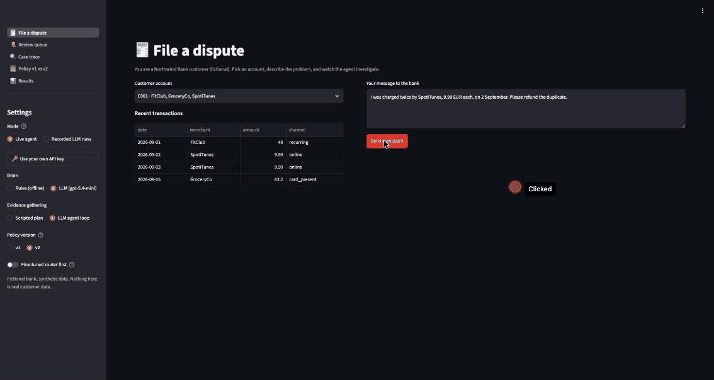
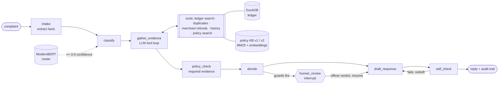

# Dispute Resolution Agent

A **state-driven LLM agent** that resolves card-payment disputes end to end. It reads the customer's complaint,
investigates their account with tools, checks a versioned policy, decides **refund / ask for info / reject / escalate to
a human**, and writes the reply. The LLM handles language and judgement; **everything that moves money is enforced in
code**.

**[▶ Live demo](https://dispute-resolution-agent-yycapp6ubuxabyf8trjcyrv.streamlit.app)**: runs offline with the rule brain, plays recorded LLM agent runs, and runs the live LLM agent
with your own OpenAI or Anthropic key (kept in your browser session only).



*Three live cases with the LLM agent loop (gpt-5.4-mini, policy v2), about 90 seconds:*
1. *Duplicate SpotiTunes charge: the agent finds the two charges a day apart and refunds 9.99 EUR.*
2. *Netflux "charged twice": the charges are a month apart, so it is rejected as a subscription, with the next step.*
3. *899 EUR unrecognised LuxWatch payment: above the 300 EUR review threshold, so it goes to the review queue. The officer
   approves it, and the case resumes from its checkpoint to write and check the reply.*

## Headline results

On 203 human-reviewed dispute cases (17 scenarios, labels correct by construction):

| | |
|---|---|
| **Decision accuracy** | **100%** in 3 of 3 runs (gpt-5.4-mini), vs 84.2% for a regex baseline |
| **Unsafe refunds** (money paid where policy says no) | **0%** in every configuration with full guards |
| **Cost / latency** | $0.0024 and 3.8 s per case (with the fine-tuned router) |
| **Policy update** (40 boundary cases) | v1 → v2 changed **exactly the 32 decisions** the new rules require, with no code change |
| **Fine-tuned router** (ModernBERT-base) | 93.2% on Banking77, **9 ms** vs 1.2 s for the LLM, trained in 9 minutes on a laptop |

## Architecture



| Concern | Where | What it does |
|---|---|---|
| State machine | `graph.py` (LangGraph) | typed steps, routing, **money and evidence guards**, step budget, human interrupt, SQLite checkpoints |
| Evidence gathering | `evidence.py` | one tool executor, two drivers: a scripted plan, or the **LLM choosing typed tool calls** under a budget (repeats refused, errors fed back, coverage gaps filled by code and recorded) |
| Language and judgement | `brain.py`, `llm_brain.py` | rule baseline, Claude and OpenAI brains (structured outputs, per-step reasoning effort) behind one interface |
| Policy | `kb/policies/v1`, `v2` | versioned clauses whose `Parameters:` lines (filing window, review threshold…) are what the guards enforce |
| Retrieval | `tools/kb.py`, `tools/embeddings.py` | BM25, dense and hybrid (RRF) search; content-hash embedding cache for incremental re-indexing |
| Router | `router.py`, `scripts/train_router.py` | fine-tuned ModernBERT classifies first; the LLM only below 0.9 confidence |
| Replies | `replies.py` | code-computed facts and decision-specific guidance for the writer; fact checks on the draft |
| Evaluation | `eval/` | golden sets, metrics, failure taxonomy, repeats, ablations, a validated LLM judge, CI quality gates |
| Demo | `app/` (Streamlit) | customer view, review queue, case trace, policy switch, results; recorded runs need no API key |

## Design decisions

1. **A state machine, not a free-running ReAct loop.** Disputes have a known shape and need an audit trail, so every
   step is explicit and testable, and guards sit between steps. The LLM explores only where exploration helps
   (choosing what evidence to gather), and code guarantees the checks policy depends on. Measured: without those
   coverage checks the agent drops to 94.6%, because it sometimes skips the duplicate check.
2. **Deterministic first.** The model never computes money, dates or thresholds. Refund amounts come from code. A refund
   that contradicts hard evidence (merchant already refunded, no duplicate found, filed late, repeat fraud claimant) goes
   to a human, so even a weak model cannot pay out wrongly.
3. **Policy as data.** Rule values live in the policy documents, so publishing a new version changes behaviour without
   code changes. Every decision records its policy version and parameters, and a paused case keeps its version on resume.
4. **Labels correct by construction.** Test scenarios are built in code (ledger rows plus the outcome policy implies), the
   LLM writes only the complaint text, and a human reviewed every case. The LLM never grades its own homework.
5. **Measure, don't assume.** Repeated runs, ablations, a failure taxonomy, cost and latency on every run, and an LLM judge
   validated against human labels before it was trusted.
6. **SDKs plus LangGraph, not a framework agent.** LangGraph supplies state, checkpoints and human-in-the-loop; model calls
   go through the official SDKs, and the agent loop is written out, so every step is explicit and guarded.

## Results in detail

### Configurations (golden_v1, 203 cases)

| Configuration | Decision acc. | Unsafe refunds | Cost / case | Latency / case |
|---|---|---|---|---|
| Rule baseline (regex) | 84.2% | 0% | $0 | 3 ms |
| gpt-5.4-nano, scripted plan | 87.2% | 0% (1% before the repeat-claims guard) | $0.0008 | 5.4 s |
| **gpt-5.4-mini, scripted plan** (3 runs) | **100% ± 0** | 0% | $0.0026 | 4.1 s |
| gpt-5.4-mini, plan + router (3 runs) | 100% ± 0 | 0% | **$0.0024** | **3.8 s** |
| gpt-5.4-mini, LLM agent loop | 100% | 0% | $0.0074 | 12.9 s |
| gpt-5.4-mini, agent loop + hybrid retrieval | 100% | 0% | $0.0073 | 10.3 s |
| gpt-5.5, scripted plan | 100% | 0% | $0.0227 | 8.5 s |
| *ablation:* agent loop without code coverage checks | 94.6% | **0%** | $0.0072 | – |

- **The strong model adds nothing here** at 9× the cost. On this set the scripted plan matches the agent loop at a third of
  the cost; the loop should earn its cost on messier cases (several candidate transactions, ambiguous merchants).
- **The weak model found a real gap.** gpt-5.4-nano refunded two repeat fraud claimants, the one refund-forbidding rule
  without a code guard. Strong models never needed that guard, so its absence was invisible until a weak model was tried.
- **When the agent fails, it fails cautious.** Failure taxonomy over all gpt-5.4-mini runs: no unsafe refunds, wrong
  dispute types or wrong amounts. Most failures are the model escalating a case that policy could have decided.
- **More reasoning made it worse:** medium reasoning effort lowered accuracy (the model over-escalated unrecognised
  payments) and made the agent skip more checks, at +86% cost.

### Policy update without code change (40 human-reviewed boundary cases)

Policy v2 shortens the filing window (120 → 90 days) and lowers the human-review threshold (500 → 300 EUR).

| Run (agent loop, gpt-5.4-mini) | Correct | Decisions changed vs v1 |
|---|---|---|
| policy v1 | 40/40 | – |
| policy v2 | 40/40 | **32/32 expected flips** (16 refund → reject, 16 refund → escalate); 8 controls unchanged |

### Fine-tuned router (ModernBERT-base, Apple M5 Pro, 9 minutes)

| | ModernBERT router | Zero-shot LLM (gpt-5.4-mini) |
|---|---|---|
| Banking77 test, 77 intents | **93.2% acc / 0.932 macro-F1** | – |
| Dispute type (6 classes) | **98.9% / 0.969** | 90.7% / 0.757 |
| Latency / message | **9 ms** | 1.2 s |
| Cost / 1k messages | ~$0 (local) | $0.31 |

Much of the gap to the LLM is label-convention disagreement (the router learned my mapping, e.g. "lost card" → other; the
LLM never saw it). On the longer golden complaints the router alone scores 96.7%, but its confidence is calibrated: at ≥ 0.9
it was right every time, so it handles 52% of classifications and the LLM takes the rest.

### LLM judge for reply quality, validated against human labels

40 replies (25 real, 15 with defects injected by code, labelled blind), 5 questions, adjudicated:

| | Agreement on "OK to send" | Cohen's kappa | Injected defects caught |
|---|---|---|---|
| Human, first pass | – | – | 11/15 (missed every swapped merchant) |
| Judge v1 (3-vote majority) | 82% | 0.65 | 15/15 |
| Judge v2 (+ policy text, today, computed day counts) | 85% | 0.69 | 14/15 |

A good screen for objective errors, weak on tone (kappa ≤ 0.24) and arithmetic. v2 was tuned on the same replies, so its
numbers are optimistic. Used as a before/after metric, it measured a reply-writer fix: "OK to send" 72% → 76%, factual
accuracy of request-for-info replies 0.71 → 0.92.

### Policy retrieval (156 queries, 37 clauses in v2)

| Candidates | BM25 recall@3 | Dense recall@3 | Hybrid (RRF) recall@3 | Hybrid MRR |
|---|---|---|---|---|
| filtered to the dispute type (the agent's default) | 1.00 | 1.00 | 1.00 | 0.83 |
| all clauses compete | 0.66 | 0.79 | **0.80** | **0.64** |

## Try it

```bash
uv sync                              # add --extra router for the fine-tuned router (PyTorch)
uv run streamlit run app/main.py     # demo: works offline (rule brain) and plays recorded LLM runs without a key
uv run pytest                        # 54 tests
uv run python eval/run_eval.py --brain rules --golden eval/golden_v1.jsonl

# command line: durable cases that pause for a human and resume later
uv run dispute-agent run "I don't recognise a 899.00 EUR charge from LuxWatch on 2026-09-15." --customer C006
uv run dispute-agent pending
uv run dispute-agent resume <case_id> --decision refund --refund-amount 899 --note "verified by phone"

# LLM runs: configure .env (see .env.example: Anthropic, OpenAI, or a LiteLLM proxy)
uv run python scripts/check_llm.py
uv run python eval/run_eval.py --brain llm --evidence agent --golden eval/golden_v1.jsonl --workers 8 --repeats 3
```

CI runs the tests and the offline evals on every push, with quality gates (minimum accuracy, zero unsafe refunds).

### Hosted demo and bring-your-own-key

The hosted demo (Streamlit Community Cloud, `requirements.txt`, entry point `app/main.py`) runs in **public mode** (no `.env`):
the rule brain and the recorded LLM runs work without any key, and visitors can paste **their own** OpenAI or Anthropic
key to run the live LLM agent. The key is kept only in that browser session's server-side state and sent directly to the
provider's official endpoint. It is never put in environment variables or shared caches, never stored with the case
or in the checkpoint database, and masked in error messages. Each visitor sees only their own cases. Server environment
keys are ignored in public mode. All of this is covered by `tests/test_byok_security.py`.

## Limitations

- **Synthetic data.** Complaints are LLM-written from code-built scenarios and human-reviewed; the ledger and the bank's
  policy are fictional. There is no public dataset of real card disputes with outcomes.
- **One model family** for most results (gpt-5.4-mini via an OpenAI-compatible proxy). The Claude brain is implemented
  and unit-tested but not benchmarked here.
- **The test set is easier than real life:** one disputed transaction per case, clean merchant names, one problem per
  complaint. A harder set (multiple candidates, mixed claims) is the natural next step, and where the agent loop should
  beat the scripted plan.
- The LLM judge was tuned on its own validation set; a fresh labelled batch is needed for an unbiased estimate.

## Data

Banking77 (PolyAI, CC-BY-4.0) for the router; LLM-written, human-reviewed complaints on a synthetic ledger; a fictional
bank policy. No real customer or company data. [PLAN.md](PLAN.md) has the full build log and every finding.
